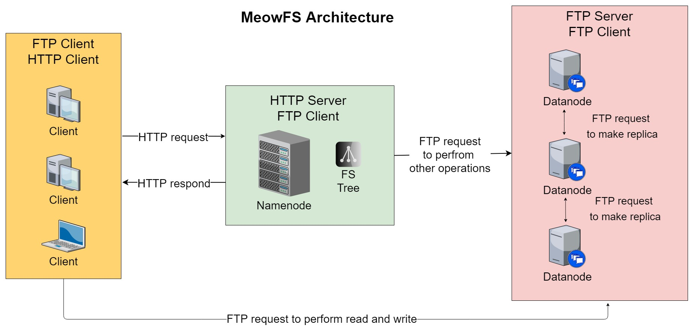

# Distributed-File-System
Assignment for Distributed Systems subject at Innopolis University, 5th semester

Made by Vyacheslav Shults (B17-DS1), Arina Fedorovskaya (B17-SE1), Irek Nazmiev (B17-SE2).

## How to install
> Further steps are described for Linux-family operating systems. Project doesn't support any other not-Unix OS.

### Client

1. Download file client/create_client.sh.

2. Run shell script for client program setup.
```
sh create_client.sh
```

## How to use

### Client

All commands are performed through `meowfs` keyword:
```
meowfs <command> <arg1> <arg2>
```

## Architecture diagram


### Decription of communication protocols
All communication protocols can be divided on two types for either of them there are exists their own paths to perform communocation.

First type of operations does not involve uploading files to datanodes (initialize, create, delete, info, copy, move, open directory, read directory, make directory, delete directory). First, client sends HTTP request to namenode, then namenode updates his file systmen tree, figures out which datanodes should be updated and sends FTP request to this datanodes to perform the corresponding operation. In case of open directory, we do not even need to send requeat to datanodes, can take all information from namenode.

Second type of operations does involve uploading files to datanodes (read and write). As wel as in previous case, client sends HTTP request to namenode and it figures out that datanodes have enough space to write the file (the total sum of sudh nodes is equal to number of replicas we want), then client pings all datanodes, starts upload the file to closest server and return the ip of datanode to which client uploaded the file. Datanode sends FTP request to this datanode to force it to start making replicas on the other datanodes which ips namenode provided.
